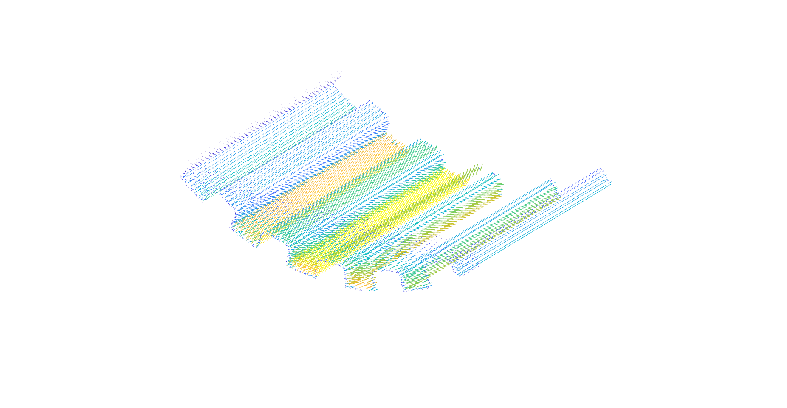

# Wheel Locomotion Using 3D-RFT and Sand Deformation Model

## Overview

This code applies 3D-RFT method and sand deformation simulator to model wheel-soil interaction. Refer to the paper for detail implementaion.

Authors: Qishun Yu, Catherine Pavlov, Wooshik Kim

Affiliation: [The Robomechanics Lab at Carnegie Mellon University](https://www.cmu.edu/me/robomechanicslab/) 

The code has been tested under [ROS] Melodic on Ubuntu 18.04.
This is research code, expect that it changes often and any fitness for a particular purpose is disclaimed.

## Usage

The current procedure to generate forces and sand deformation heighmap is as follows:

- `wheel/readWheelStl.m` : This script should run first to export mesh representaion from ".stl" file. The wheel geometry data is stored as:
  - data.Points : Contains all the mesh center locations in 3D (3 \* n)
  - data.Area : Contains the mesh area information (1 \* n)
  - data.Normals : Contains all the mesh normal vectors (3 \* n)
- `RFT3D/testSingleRFT.m` : This script shows an example of running the proposed methods. The exported wheel geometry data ("grousered_wheel_125.mat") is passed to the RFT calculation method

## Functions

- `RFT3D/RFT3D.m` : 3DRFT methods
- `RFT3D/RFT3DSandfunc.m`: 3DRFT+SDM methods
- `output/dataprocess.m` : process and plot the output forces
